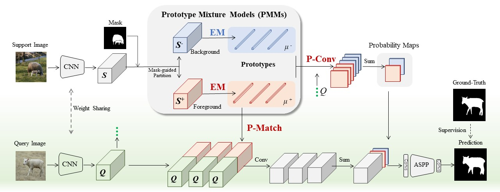
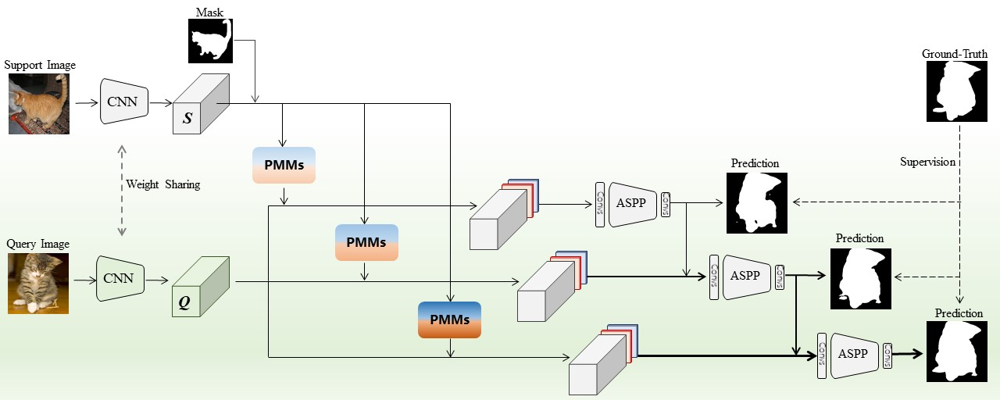

# Prototype Mixture Models
This code is for the paper "[Prototype Mixture Models for Few-shot Semantic Segmentation](https://arxiv.org/pdf/2008.03898.pdf)" in European Conference on Computer Vision(ECCV 2020).

PMMs architecture:

RPMMS architecture:



## Overview
This code contains two methods called PMMs and RPMMs.You can train or test them on Pascal voc or COCO dataset.

The experiments are divided into into 4 independent groups for cross validation.
- `config/` contains the config setting file for data and network;
- `data/` contains the dataloader and dataset;
- `data_list/` contains the data list for training and inference;
- `models/` contains the backbone & PMMs module;
- `networks/` contains the implementation of the PMMs(`FPMMs.py`) & RPMMs(`FRPMMs.py`);
- `scripts/` contains the shell file to use this code succinctly;
- `utils/` contains other dependent code;

## Dependencies
python == 3.7,
pytorch1.0,

torchvision,
pillow,
opencv-python,
pandas,
matplotlib,
scikit-image

## Usage
This code is very simple to use. You can train and test it just follow the steps below. 
### Preparation
After downloading the code, installing dependencies. You should modify the data path and model path in `config/settings.py`.

Note that you may need to check the hierarchy of the dataset in `data/voc_train.py`, `data/voc_val.py`, `data/coco_val.py`, `data/coco_val.py`
### Training
```
cd scripts
sh train_group0.sh
```
### Inference
If you want to test all of the saved models, you can use:
```
python test_all_frame.py
```
If you want to test our pretrained model, you can download them from [https://github.com/ECCV20/PMMs/tree/master/snapshots/FRPMMs](https://github.com/ECCV20/PMMs/tree/master/snapshots/FRPMMs). And test them using:
```
python test_frame.py
```

## Cross-validation classes for Pascal-5<sup>i</sup>
|Dataset|Test class|
|  ----  | ----  |
|Pascal-5<sup>0</sup>|aeroplane, bicycle, bird, boat, bottle|
|Pascal-5<sup>1</sup>|bus, car, cat, chair, cow|
|Pascal-5<sup>2</sup>|diningtable, dog, horse, motorbike, person|
|Pascal-5<sup>3</sup>|potted plant, sheep, sofa, train, tv/monitor|


## Cross-validation classes for COCO-20<sup>i</sup>
|Dataset|Test class|
|  ----  | ----  |
|COCO-20<sup>0</sup>|person, airplane, boat, parking meter, dog,<br>elephant, backpack, suitcase, sports ball, skateboard,<br>wine glass, spoon, sandwich, hot dog, chair,<br>dining table, mouse, microwave, scissors|
|COCO-20<sup>1</sup>|bicycle, bus, traffic light, bench, <br>horse, bear, umbrella, frisbee, kite, surfboard, <br>cup, bowl, orange, pizza, couch,<br>toilet, remote, oven, book, teddy bear|
|COCO-20<sup>2</sup>|car, train, fire hydrant, bird, sheep, <br>zebra, handbag, skis, baseball bat, tennis racket, <br>fork, banana, broccoli, donut, potted plant, <br>tv, keyboard, sink, toaster, clock, hair drier|
|COCO-20<sup>3</sup>|motorcycle, truck, stop sign, cat, cow, <br>giraffe, tie, snowboard, baseball glove, bottle, <br>knife, apple, carrot, cake, bed, <br>laptop, cell phone, refrigerator, vase, toothbrush|

## Performance
<table>
    <tr>
        <td>Setting</td>
        <td>Backbone</td>
        <td>Method</td>
        <td>Pascal-5<sup>0</sup></td>
        <td>Pascal-5<sup>1</sup></td>
        <td>Pascal-5<sup>2</sup></td>
        <td>Pascal-5<sup>3</sup></td>
        <td>Mean</td>
    </tr>
    <tr>
        <td rowspan="3">1-shot</td>
        <td>VGG16</td>
        <td>RPMMs</td>
        <td>47.14</td>
        <td>65.82</td>
        <td>50.57</td>
        <td>48.54</td>
        <td>53.02</td>
    </tr>
    <tr>
        <td rowspan="2">Resnet50</td>
        <td>PMMs</td>
        <td>51.98</td>
        <td>67.54</td>
        <td>51.54</td>
        <td>49.81</td>
        <td>55.22</td>
    </tr>
    <tr>
        <td>RPMMs</td>
        <td>55.15</td>
        <td>66.91</td>
        <td>52.61</td>
        <td>50.68</td>
        <td>56.34</td>
    </tr>
    <tr>
        <td rowspan="3">5-shot</td>
        <td>VGG16</td>
        <td>RPMMs</td>
        <td>50.00</td>
        <td>66.46</td>
        <td>51.94</td>
        <td>47.64</td>
        <td>54.01</td>
    </tr>
    <tr>
        <td rowspan="2">Resnet50</td>
        <td>PMMs</td>
        <td>55.03</td>
        <td>68.22</td>
        <td>52.89</td>
        <td>51.11</td>
        <td>56.81</td>
    </tr>
    <tr>
        <td>RPMMs</td>
        <td>56.28</td>
        <td>67.34</td>
        <td>54.52</td>
        <td>51.00</td>
        <td>57.30</td>
    </tr>
</table>

## Citations
Please consider citing our paper in your publications if the project helps your research.

```
@inproceedings{PMMs2020,
  title   =  {Prototype Mixture Models for Few-shot Semantic Segmentation},
  author  =  {Boyu Yang and Chang Liu and Bohao Li and Jianbin Jiao, and Ye, Qixiang},
  booktitle =  {ECCV},
  year    =  {2020}
}
```

## References
Some of our Code is based on the following code:

EMANet:[https://github.com/XiaLiPKU/EMANet](https://github.com/XiaLiPKU/EMANet)

CANet:[https://github.com/icoz69/CaNet](https://github.com/icoz69/CaNet)

SG-One:[https://github.com/xiaomengyc/SG-One](https://github.com/xiaomengyc/SG-One)

